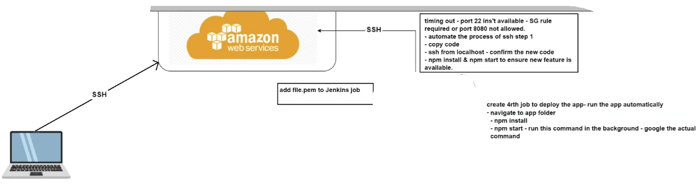
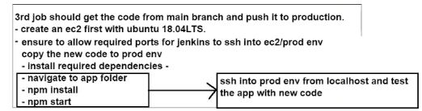

# CD

Firstly we want to get 
## Delivery
1. Create ec2 instance
2. Allow 8080 22 for now (we will need port 80 and 3000 later)
3. Run these commands
```bash
cd app
npm install
npm test
```

## Deploy
1. Automate so Jenkins SSH into instance
2. 
git publisher - plugin to be used to merge code from dev to main
**Avoid using git commands in execute shell**
- git merge conflict - related issues - branches issues