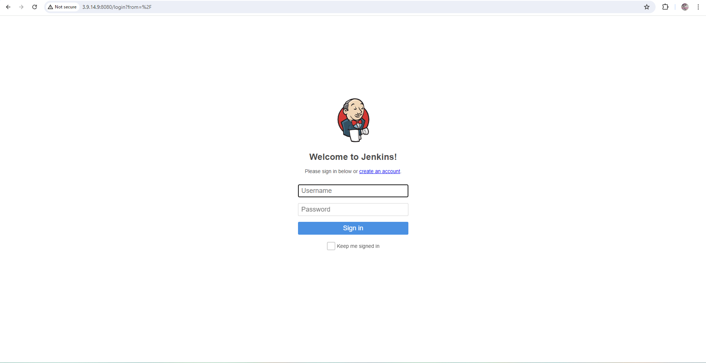
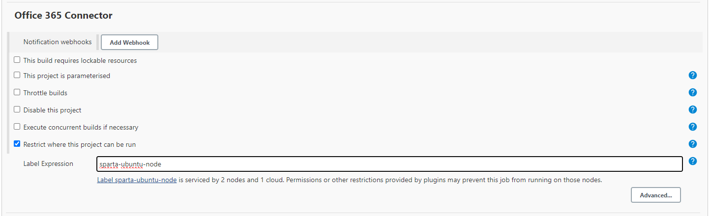
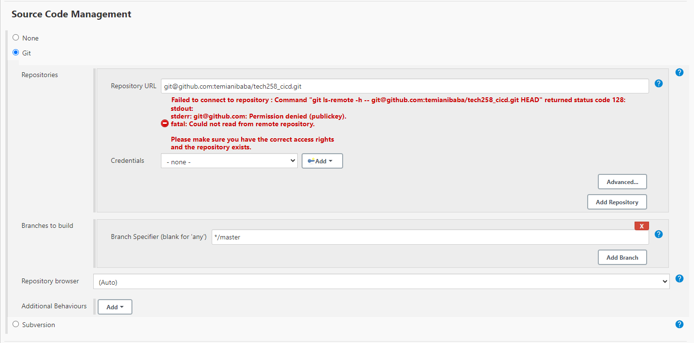
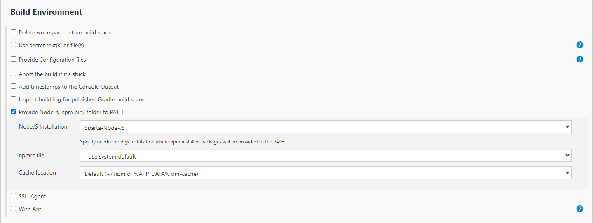
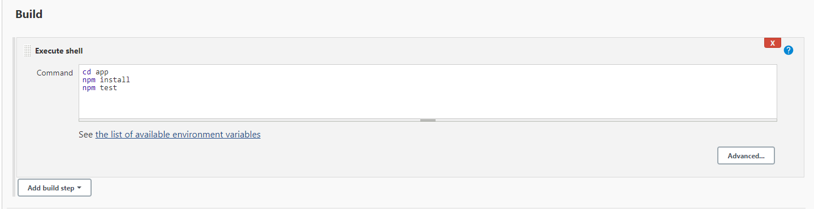

# CI
- [CI](#ci)
  - [Creating your first job](#creating-your-first-job)
    - [1. Login](#1-login)
    - [2. New item](#2-new-item)
    - [3. Name](#3-name)
    - [4. Description](#4-description)
    - [5. Copy github https clone link](#5-copy-github-https-clone-link)
    - [6. Restrict where project can be run: sparta-ubuntu-node](#6-restrict-where-project-can-be-run-sparta-ubuntu-node)
    - [7. Source code: copy ssh github link](#7-source-code-copy-ssh-github-link)
    - [8. Provide private key](#8-provide-private-key)
    - [9. Change branch to main](#9-change-branch-to-main)
    - [10. Tick Provide Node \& npm bin/ folder to PATH](#10-tick-provide-node--npm-bin-folder-to-path)
    - [11. Go to build and change to execute shell](#11-go-to-build-and-change-to-execute-shell)
    - [Done](#done)
  - [How to create webhook](#how-to-create-webhook)
  - [CI plan](#ci-plan)

## Creating your first job
### 1. Login 

### 2. New item

### 3. Name

### 4. Description

### 5. Copy github https clone link
<br>

### 6. Restrict where project can be run: sparta-ubuntu-node

### 7. Source code: copy ssh github link
<br>

### 8. Provide private key
In terminal cd to ssh keys and use: `cat <private key>`<br>
Click on add key and switch the kind to SSH<br>
**GIVE YOUR KEY AN USERNAME**

Paste private key into area
### 9. Change branch to main

### 10. Tick Provide Node & npm bin/ folder to PATH

### 11. Go to build and change to execute shell
```bash
cd app
npm install
npm test
```
<br>
### Done
**Click build to execute job**

## How to create webhook
https://www.blazemeter.com/blog/how-to-integrate-your-github-repository-to-your-jenkins-project<br>
Use **http://jekins_IP/github-webhook/**

## CI plan
<br>
We would like to combine and test codes made by different developers quickly.To do this we would have to check the code works first then merge it to the main working branch.
1. Create dev branch using `git checkout -b dev` **we do not work in the main or master branch** then push on dev branch to update github
2. Make first job: this will have a webhook to build whenever code is pushed on dev branch, and post build option of triggering second job
3. Create second job called "merge to main" use post build "git publisher" and merge before build option to merge 
