# CICD demo
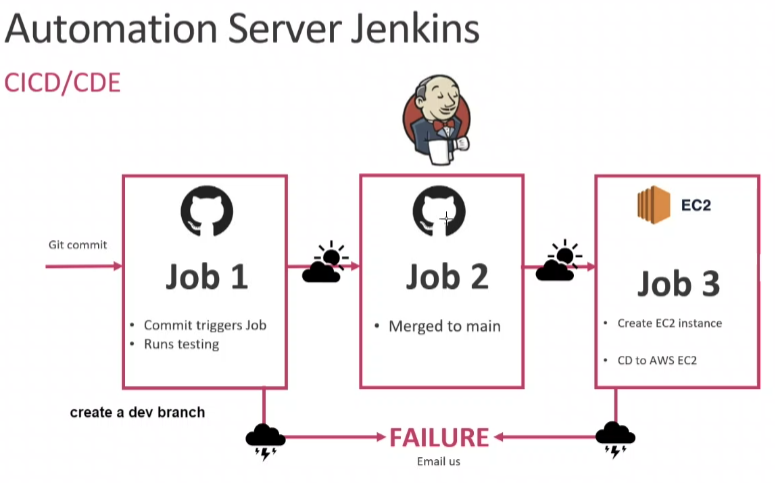<br>
Our goal is to automate the SDLV (software develplment life cycle), to do this we have to separate the main goal into smaller ones. 
1. **Firstly,** we want to test our code works, thats what job one does.
2. **Secondly,** we may be working with other developers so we will need to merge the codes collected in the repo if it works, this is what job two does.
3. **Thirdly,** once we have our working code on the main branch we want to make it available to users, so we need to put the code onto an EC2 instance and run it. This is what job 3 does.
- [CICD demo](#cicd-demo)
  - [Creating your first job](#creating-your-first-job)
    - [1. Login](#1-login)
    - [2. New item](#2-new-item)
    - [3. Name](#3-name)
    - [4. Description](#4-description)
    - [5. Copy github https clone link](#5-copy-github-https-clone-link)
    - [6. Restrict where project can be run: sparta-ubuntu-node](#6-restrict-where-project-can-be-run-sparta-ubuntu-node)
    - [7. Source code: copy ssh github link](#7-source-code-copy-ssh-github-link)
    - [8. Provide private key](#8-provide-private-key)
    - [9. Change branch to main](#9-change-branch-to-main)
    - [10. Tick Provide Node \& npm bin/ folder to PATH](#10-tick-provide-node--npm-bin-folder-to-path)
    - [11. Go to build and change to execute shell](#11-go-to-build-and-change-to-execute-shell)
    - [Done](#done)
  - [How to create webhook](#how-to-create-webhook)
  - [CI plan](#ci-plan)
- [CD](#cd)
  - [Delivery and Deployment](#delivery-and-deployment)
## Creating your first job
### 1. Login 
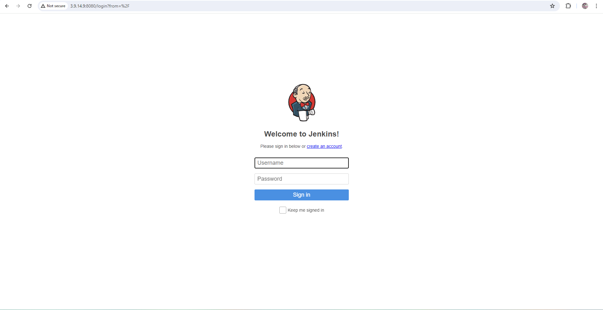
### 2. New item
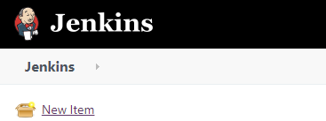
### 3. Name

### 4. Description
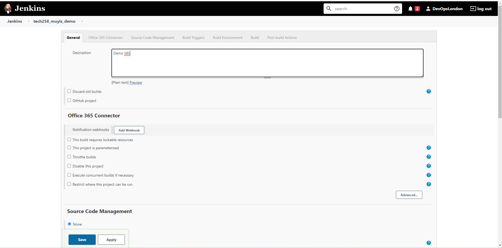
### 5. Copy github https clone link
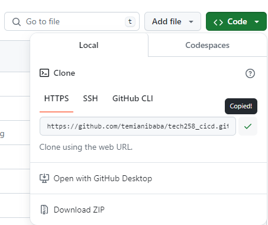<br>
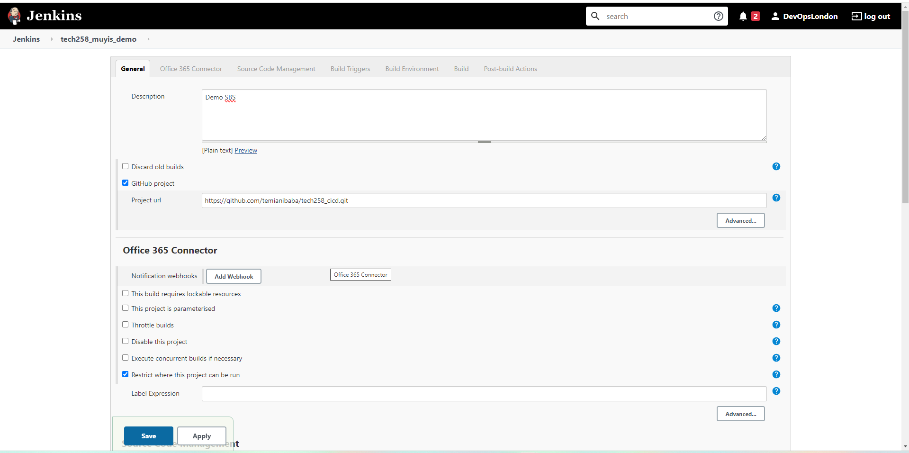
### 6. Restrict where project can be run: sparta-ubuntu-node
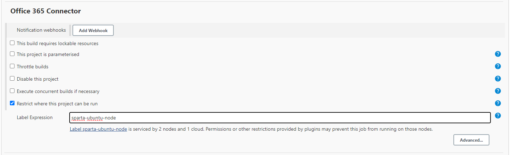
### 7. Source code: copy ssh github link
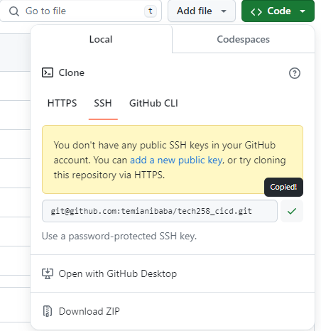<br>
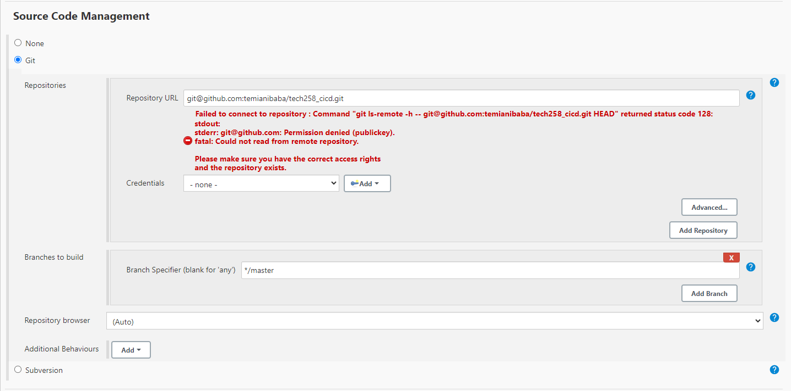
### 8. Provide private key
In terminal cd to ssh keys and use: `cat <private key>`<br>
Click on add key and switch the kind to SSH<br>
**GIVE YOUR KEY AN USERNAME**
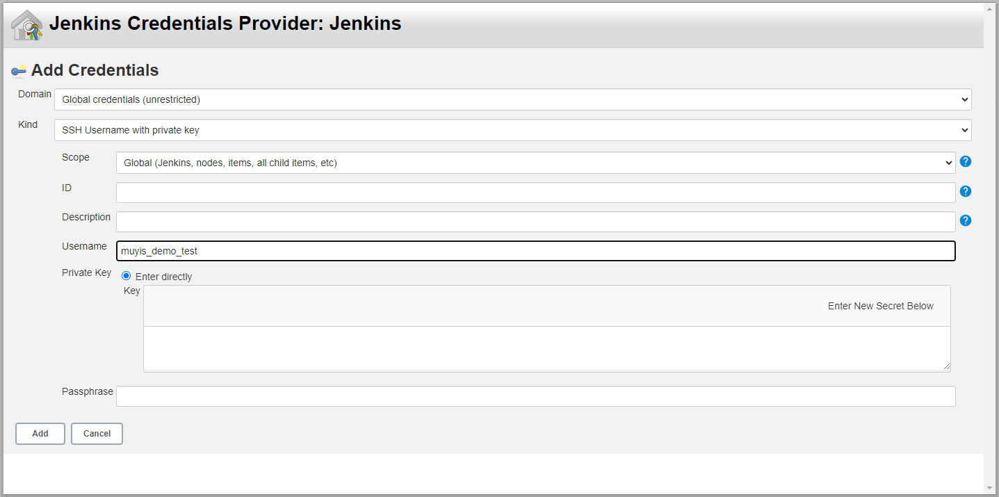
Paste private key into area
### 9. Change branch to main
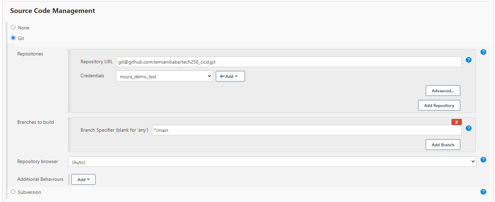
### 10. Tick Provide Node & npm bin/ folder to PATH
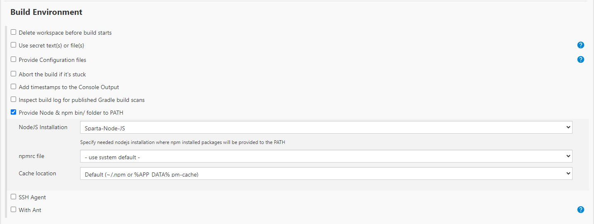
### 11. Go to build and change to execute shell
```bash
cd app
npm install
npm test
```
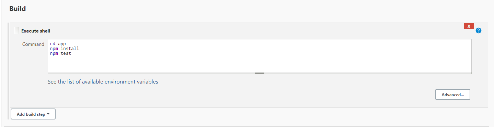<br>
### Done
**Click build to execute job**

## How to create webhook
https://www.blazemeter.com/blog/how-to-integrate-your-github-repository-to-your-jenkins-project<br>
Use **http://jekins_IP/github-webhook/**

## CI plan
<br>
We would like to combine and test codes made by different developers quickly.To do this we would have to check the code works first then merge it to the main working branch.
1. Create dev branch using `git checkout -b dev` **we do not work in the main or master branch** then push on dev branch to update github
2. Make first job: this will have a webhook to build whenever code is pushed on dev branch, and post build option of triggering second job
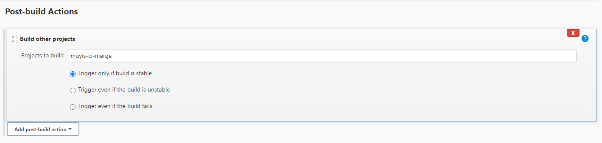
3. Create second job called "merge to main" use post build "git publisher" and merge before build option to merge 
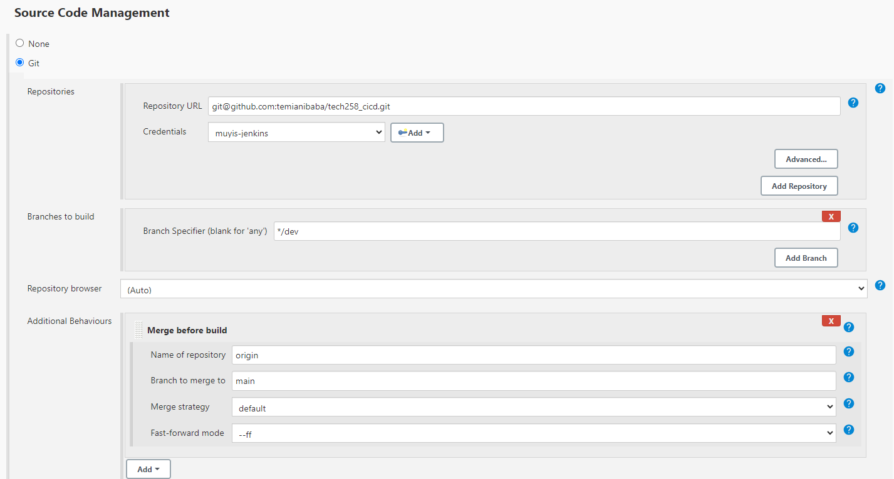
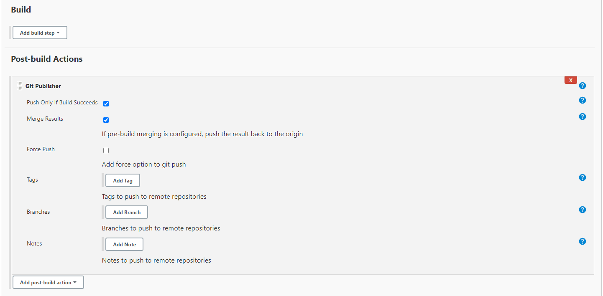

# CD
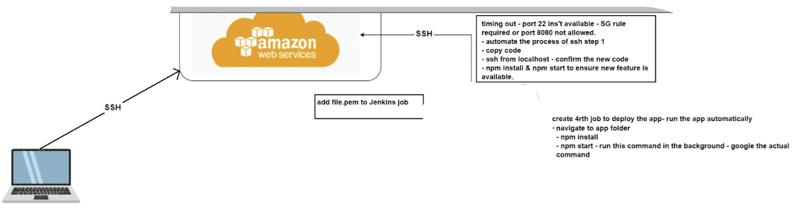<br>
In this section I will be moving the tested and merged code from the main branch github repo to an EC2 server. The end goal is to get the app up and running by just pushing code to the dev branch, I will need to add a post build action to the second job to trigger my 3rd job.<br>
**Where does Jenkins keep code?**
Go to **workspace** (where code is) comes from git hub, jenkins can then move this code to an EC2 instance.
## Delivery and Deployment
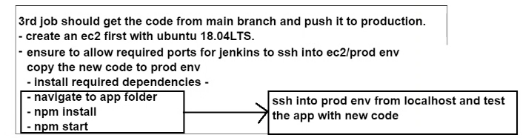
1. Launch instance with correct sg allow port 22 3000 80 8080 AND use this AMI (ami-02f0341ac93c96375)
2. Make Jenkins job including AWS SSH private key
3. Insert code in execute shell
```bash
# by pass fingerprint
ssh -o "StrictHostKeyChecking=no" ubuntu@54.194.153.179 <<EOF
# SSH into ec2
# run update and upgrade
sudo apt-get update -y
sudo apt-get upgrade -y
# install nginx
sudo apt-get install nginx -y

sudo systemctl enable nginx

EOF

# copy code from main branch
rsync -avz -e "ssh -o StrictHostKeyChecking=no" app ubuntu@ec2-54-194-153-179.eu-west-1.compute.amazonaws.com:/home/ubuntu
rsync -avz -e "ssh -o StrictHostKeyChecking=no" environment ubuntu@ec2-54-194-153-179.eu-west-1.compute.amazonaws.com:/home/ubuntu

ssh -o "StrictHostKeyChecking=no" ubuntu@54.194.153.179 <<EOF
# install required dependecies using provison.sh
sudo chmod +x ~/environment/app/provision.sh
# sudo chmod +x ~/environment/db/provision.sh
# sudo bash ./environment/db/provision.sh
sudo bash ./environment/app/provision.sh

# navigate to app folder
cd app

# start app in background
sudo pm2 kill
sudo pm2 start app.js
EOF
```

4. Create a new Jenkins Job for DB
```bash
cd app
sudo pm2 kill
sudo 
pm2 start app.js
```
5. kill pm2 install pm2 restart pm2

