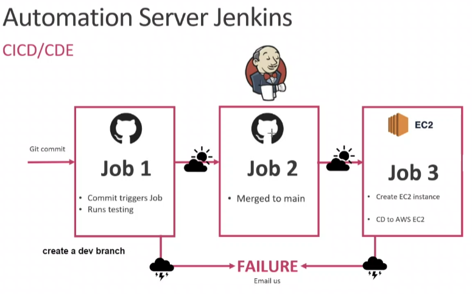

# CICD
 
Our goal is to automate the SDLV (software develplment life cycle), to do this we have to separate the main goal into smaller ones. 
1. **Firstly,** we want to test our code works, thats what job one does.
2. **Secondly,** we may be working with other developers so we will need to merge the codes collected in the repo if it works, this is what job two does.
3. **Thirdly,** once we have our working code on the main branch we want to make it available to users, so we need to put the code onto an EC2 instance and run it. This is what job 3 does. 

- [CICD](#cicd)
  - [What is CI](#what-is-ci)
  - [What is CD](#what-is-cd)
  - [Webhook](#webhook)
  - [Why CI/CD?](#why-cicd)
  - [Delivery vs Deployment](#delivery-vs-deployment)
  - [Why choose Jenkins](#why-choose-jenkins)
  - [Why use CICD](#why-use-cicd)

## What is CI
 
Continuous integration is the practice of frequently integrating code changes into a shared repository, ensuring early detection of integration errors and promoting collaboration among team members.
## What is CD
 
Continuous deployment is the automated process of releasing software changes into production environments after passing automated tests, enabling rapid and frequent delivery of updates to end-users.
## Webhook
A webhook is a mechanism that allows real-time communication between two applications, triggering events in one application based on actions or updates in another.
## Why CI/CD?
You would use Continuous Integration and Continuous Deployment (CI/CD) to automate software development processes, ensuring faster and more reliable delivery of updates, reducing manual errors, and improving overall efficiency.

## Delivery vs Deployment
**Deploy** is when the update or app goes live infront of users. 
**Delivered** is using the scp/rsync command to get the update or app into production environment. 
Delivery vs deploy depends on what business needs. 

## Why choose Jenkins

## Why use CICD
We would like to combine and test codes made by different developers quickly.To do this we would have to check the code works first then merge it to the main working branch.