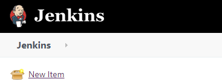
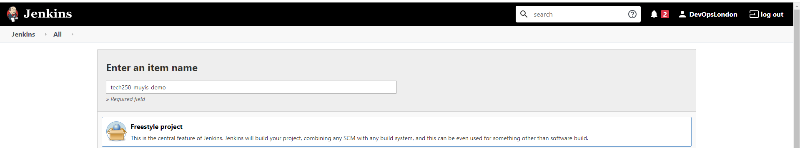
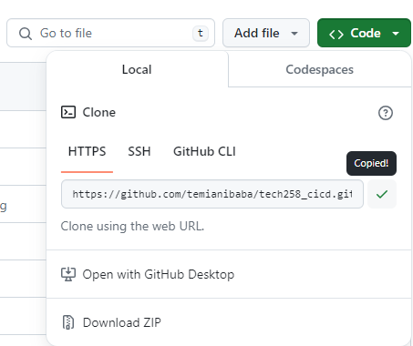
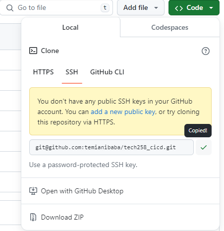

# How to make a Jenkins job
### 1. Login 

### 2. New item

### 3. Name

### 4. Description

### 5. Copy github https clone link
<br>

### 6. Restrict where project can be run: sparta-ubuntu-node

### 7. Source code: copy ssh github link
<br>

### 8. Provide private key
In terminal cd to ssh keys and use: `cat <private key>`<br>
Click on add key and switch the kind to SSH<br>
**GIVE YOUR KEY AN USERNAME**

Paste private key into area
### 9. Change branch to main

### 10. Go to build and change to execute shell
```bash
cd app
npm install
npm test
```
<br>
### Done
**Click build to execute job**

# How to create webhook
https://www.blazemeter.com/blog/how-to-integrate-your-github-repository-to-your-jenkins-project<br>
Use **http://3.9.14.9:8080/github-webhook/**