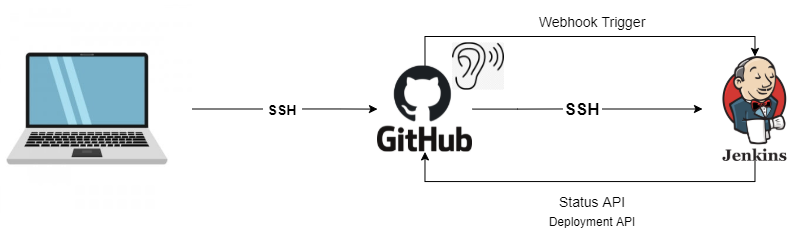
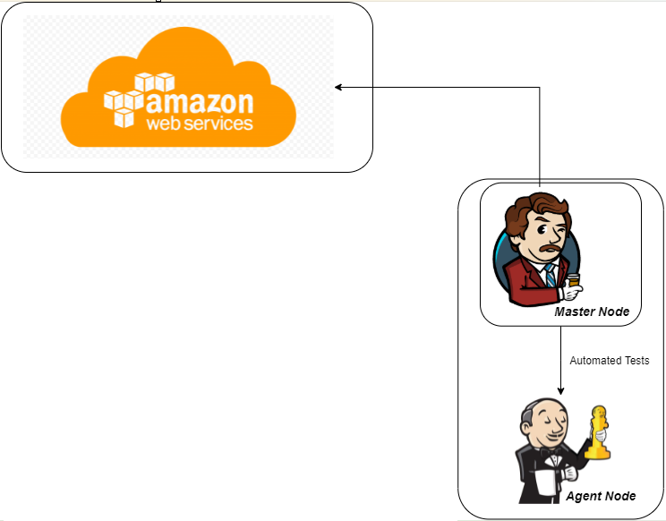

# CICD

## What is CI
 
Continuous integration is the practice of frequently integrating code changes into a shared repository, ensuring early detection of integration errors and promoting collaboration among team members.
## What is CD
 
Continuous deployment is the automated process of releasing software changes into production environments after passing automated tests, enabling rapid and frequent delivery of updates to end-users.
## Webhook
A webhook is a mechanism that allows real-time communication between two applications, triggering events in one application based on actions or updates in another.
## Why CI/CD?
You would use Continuous Integration and Continuous Deployment (CI/CD) to automate software development processes, ensuring faster and more reliable delivery of updates, reducing manual errors, and improving overall efficiency.

## Delivery vs Deployment
**Deploy** is live infront of users. 
**Delivered** is scp or pushed then npm installed and started or we get jenkins to do it for us. 
Delivery vs deploy depends on what business needs. 

## Why choose Jenkins

## Why use CICD
We would like to combine and test codes made by different developers quickly.To do this we would have to check the code works first then merge it to the main working branch.